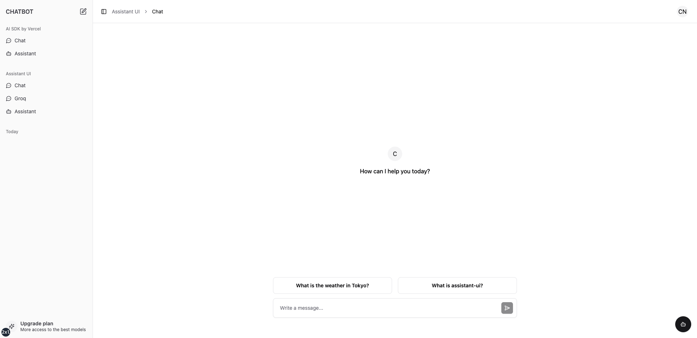

# nextjs14-aisdk4-chatbot

This is a chatbot starter template for the [Next.js](https://nextjs.org) 14 based on [AI SDK](https://sdk.vercel.ai) v4.

## Screenshots



## Denpendencies

- Next.js 14
- AI SDK v4
- Tailwindcss
- Shadcn
- assistant-ui

## Documents

- [DEPENDENCIES](./docs/DEPENDENCIES.md)
- [GIT](./docs/GIT.md)

## Getting Started

Clone the repository to the current directory.

```shell
git clone https://github.com/w3labkr/nextjs14-aisdk4-chatbot .
```

Install all modules listed as dependencies.

```shell
npm install
```

Copy of the `.env.example` if the `.env` doesn't exist.

```shell
cp .env.example .env
```

Start the development server.

```shell
npm run dev
```

## License

This software license under the [MIT License](LICENSE).
